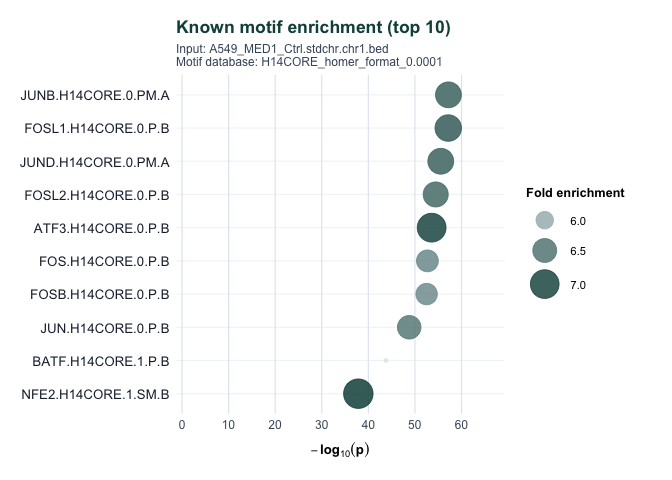
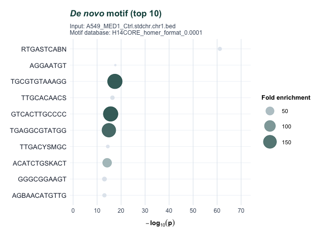
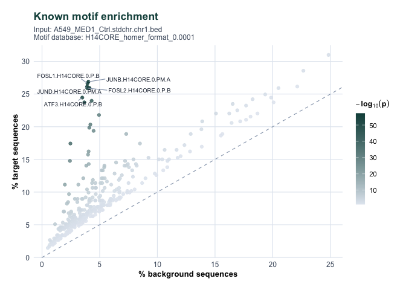
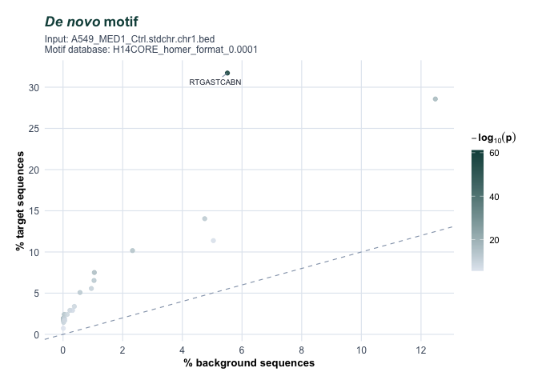
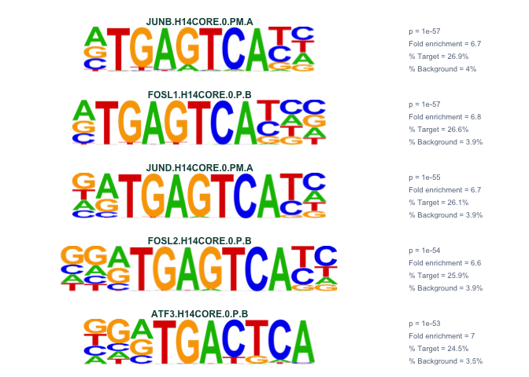
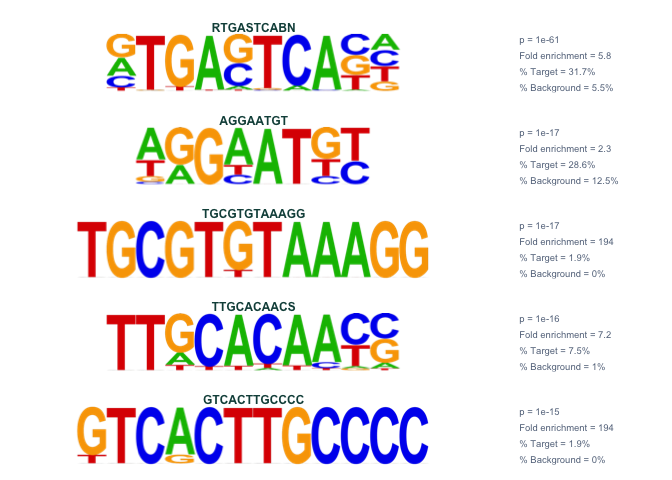
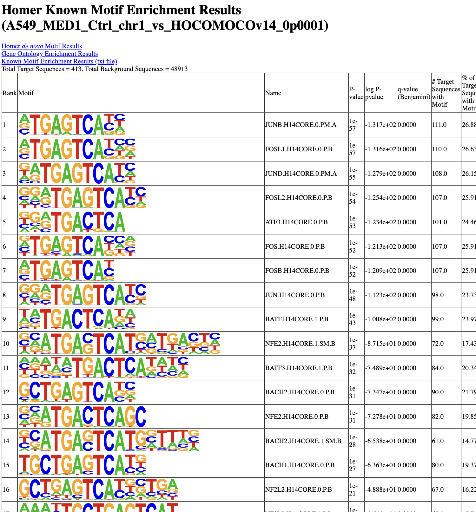
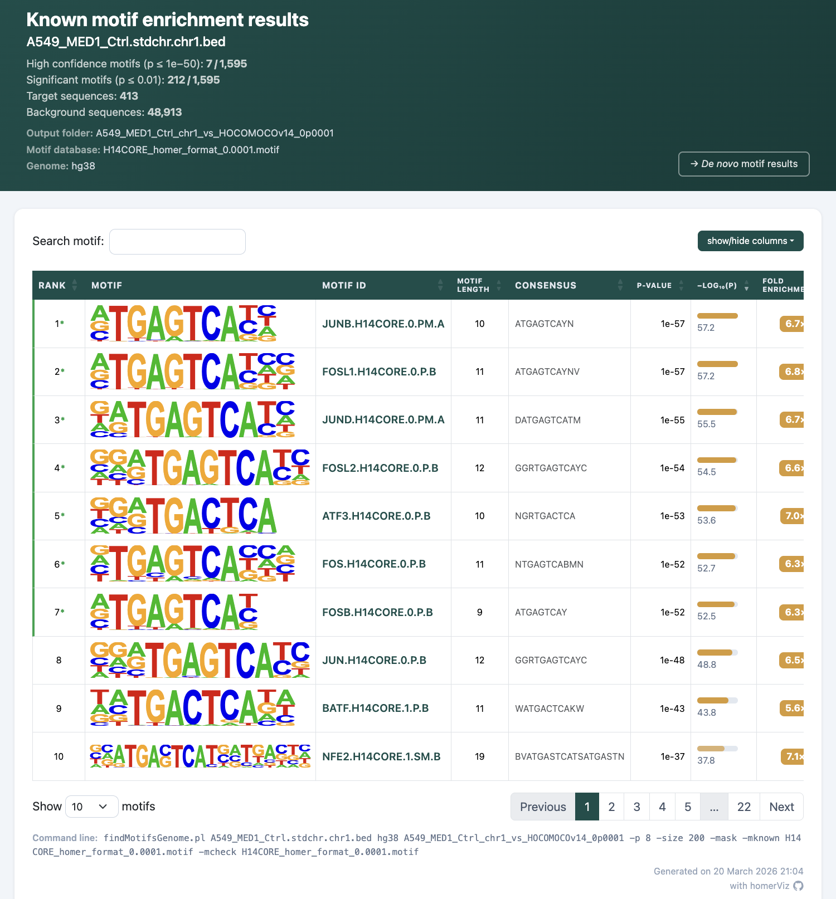
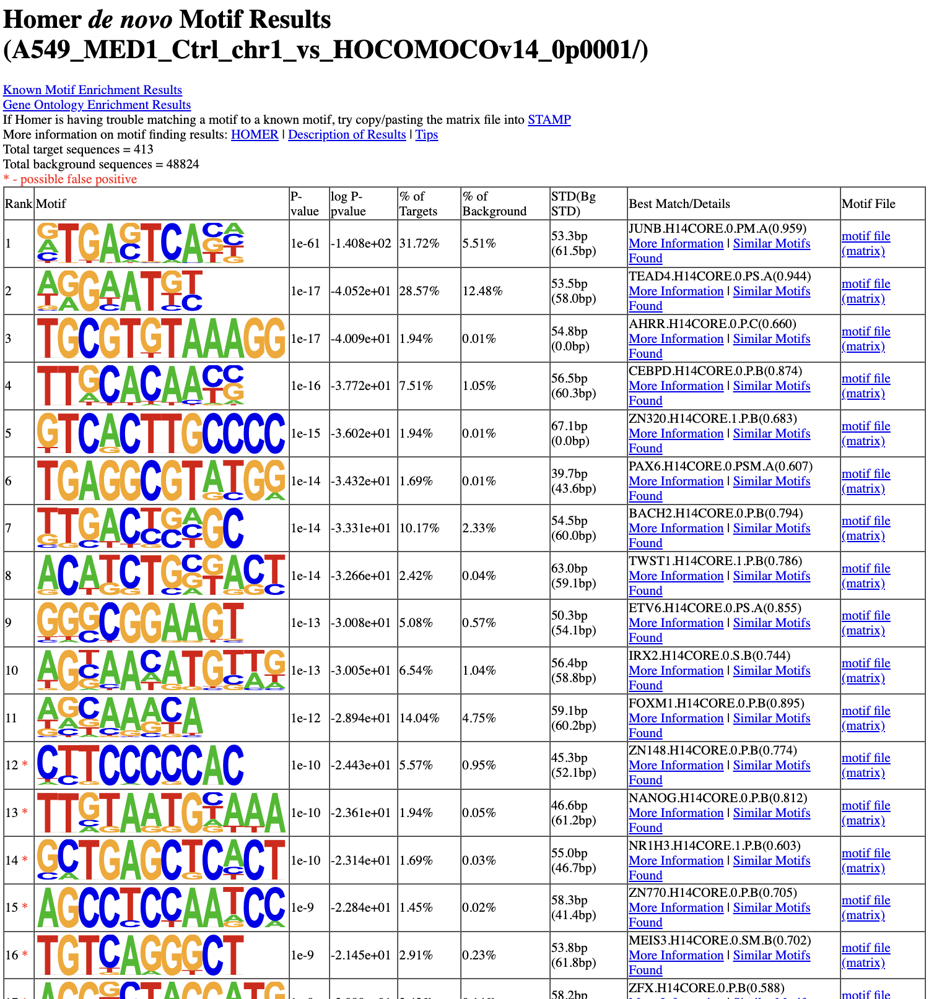
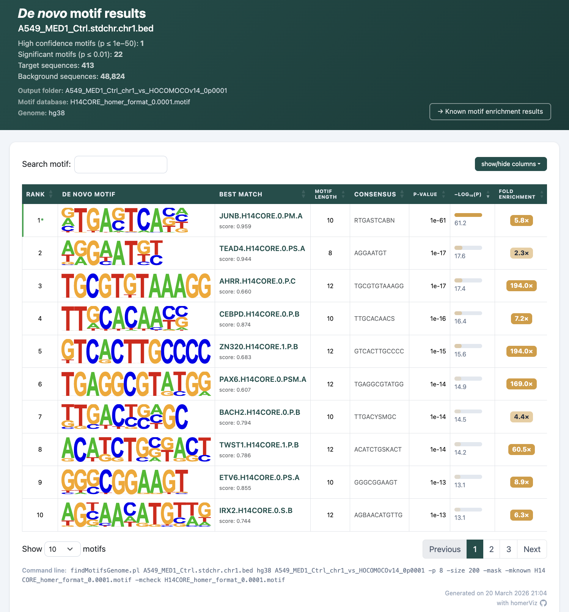

# homerViz


**Visualization tools for HOMER motif enrichment results**

**homerViz** is an R package that parses
[HOMER](http://homer.ucsd.edu/homer/) `findMotifsGenome.pl` output
directories into tidy data frames, generates publication-ready
visualizations, and produces interactive HTML reports to facilitate the
exploration of motif enrichment results.

## Features

- **Parsing**: reads `knownResults.txt` and `homerResults/motif*.motif`
  files into tidy data frames with consistent column names.
- **Dot plots**: top enriched motifs ranked by significance, coloured
  and sized by fold enrichment.
- **Scatter plots**: % target vs % background, coloured by significance
  and sized by fold enrichment.
- **Logo panels**: motif logo grids with embedded enrichment statistics.
- **HTML reports**: interactive, sortable table reports with motif logos
  for both known and de novo results.

## Installation

To install the development version from GitHub, use:

``` r
# install.packages("pak")  # if not already installed
pak::pak("ckntav/homerViz")

# or, alternatively:
# install.packages("devtools")  # if not already installed
devtools::install_github("ckntav/homerViz")
```

## Quick start

This brief example demonstrates the visualization capabilities of
homerViz using MED1 ChIP-seq data from the A549 cell line, referenced
against the HOCOMOCO motif database (v14).

The motif enrichment analysis was performed using this command line:

``` bash
findMotifsGenome.pl A549_MED1_Ctrl.stdchr.chr1.bed \
    hg38 \
    A549_MED1_Ctrl_chr1_vs_HOCOMOCOv14_0p0001 \
    -p 8 -size 200 -mask \
    -mknown H14CORE_homer_format_0.0001.motif \
    -mcheck H14CORE_homer_format_0.0001.motif
```

### 1. Read HOMER output files

``` r
library(homerViz)

# Define the example HOMER output directory
example_dir <- system.file(
    "extdata",
    "A549_MED1_Ctrl_chr1_vs_HOCOMOCOv14_0p0001",
    package = "homerViz"
)

# Read a HOMER output directory
homer <- read_homer_output(example_dir)
#> Reading: A549_MED1_Ctrl_chr1_vs_HOCOMOCOv14_0p0001
#>   * Known motifs:  knownResults.txt
#>   * De novo motifs: 22 motifs in homerResults/
```

### 2. Visualize top motifs

#### Dot plots

``` r
plot_known_dotplot(homer)
plot_denovo_dotplot(homer)
```



#### Scatter plots

``` r
plot_known_scatter(homer)
plot_denovo_scatter(homer)
```



#### Logo

``` r
plot_known_logos(homer)
plot_denovo_logos(homer)
```



### 3. Interactive HTML reports

``` r
save_homer_html(homer)
```

Here are examples of the HTML reports (click on a screenshot to open the
interactive report):

**Known motifs**

<table>

<tr>

<th>

original
</th>

<th>

homerViz
</th>

</tr>

<tr>

<td>

<a href="https://ckntav.github.io/homerViz/example/knownResults_original.html" target="_blank"></a>
</td>

<td>

<a href="https://ckntav.github.io/homerViz/example/knownResults_homerViz.html" target="_blank"></a>
</td>

</tr>

</table>

**De novo motifs**

<table>

<tr>

<th>

original
</th>

<th>

homerViz
</th>

</tr>

<tr>

<td>

<a href="https://ckntav.github.io/homerViz/example/homerResults_original.html" target="_blank"></a>
</td>

<td>

<a href="https://ckntav.github.io/homerViz/example/homerResults_homerViz.html" target="_blank"></a>
</td>

</tr>

</table>

> **Note:** The HTML reports load Bootstrap, DataTables, and jQuery from
> public CDNs and require an internet connection to render correctly.

## References

#### Example A549 MED1 ChIP-seq dataset

- Tav, C., Fournier, É., Fournier, M., Khadangi, F., Baguette, A., Côté,
  M.C., Silveira, M.A.D., Bérubé-Simard, F.-A., Bourque, G., Droit, A.,
  & Bilodeau, S. (2023). *Glucocorticoid stimulation induces
  regionalized gene responses within topologically associating domains.*
  **Frontiers in Genetics**, 14, 1237092.
  <a href="https://doi.org/10.3389/fgene.2023.1237092" target="_blank">
  doi:10.3389/fgene.2023.1237092 </a>

#### HOMER

- HOMER software :
  <a href="http://homer.ucsd.edu/homer/" target="_blank">
  http://homer.ucsd.edu/homer/ </a>

- Heinz, S., Benner, C., Spann, N., Bertolino, E., Lin, Y.C., Lassman,
  P., Bhatt, D.L., Benner, C., & Glass, C.K. (2010). *Simple
  combinations of lineage-determining transcription factors prime
  cis-regulatory elements required for macrophage and B cell
  identities.* **Molecular Cell**, 38(4), 576–589.
  <a href="https://doi.org/10.1016/j.molcel.2010.05.004" target="_blank">
  doi:10.1016/j.molcel.2010.05.004 </a>
